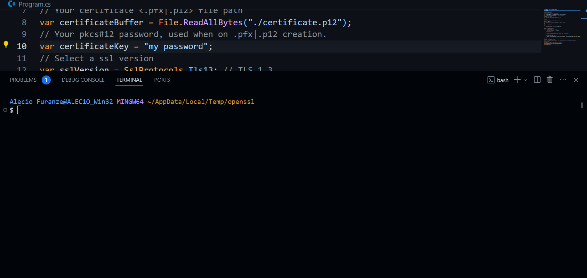
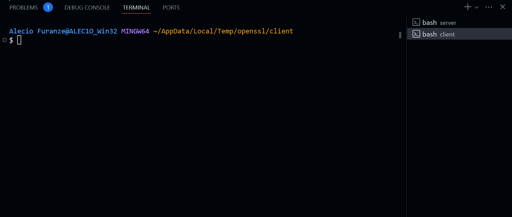

# SSL/TLS Support

On this session we will learn how to use the SSL/TLS support in Netly, over TCP connection.

### PKCS #12 Certificate

For enable connect using SSL/TLS we will use a PKCS #12 certificate.

<br/>

-   ##### What is PKCS #12 Certificate?

    -   PKCS #12 is a file format that is used to store a private key and a certificate in a single file. PKCS #12 is saved on `.pfx` or `.p12` file.
        PKCS #12 is a binary format, result from `cert.pem` file and `key.pem` file on single file.
        We can convert a `cert.pem` and `key.pem` to single archive `.pfx | .p12` file.
        Is also possible to convert a `.pfx` file to `.pem` and `.cert` file.

<br/>

-   ##### How to create PKCS #12 Certificate (OpenSSL)?

    ```bash
    # Create cert.pem and key.pem file
    openssl req -newkey rsa:2048 -nodes -keyout key.pem -x509 -days 365 -out cert.pem

    # Create PKCS #12 certificate.p12 (Convert cert.pem and key.pem to create .p12|.pfx)
    openssl pkcs12 -inkey key.pem -in cert.pem -export -out certificate.p12
    ```

    :::info
    Note when you create a PKCS #12 certificate you must choose password (is invisible and transparent when you typing), save this password and keep it safe, we need it to connect on Netly.
    :::

    

### Create TCP server using SSL/TLS

```cs
using System.Security.Authentication;
using Byter;
using Netly;

// ssl/tls requirements

// Your certificate <.pfx|.p12> file path
var certificateBuffer = File.ReadAllBytes("./certificate.p12");
// Your pkcs#12 password, used when on .pfx|.p12 creation.
var certificateKey = "<your pkcs#12 certificate password>";
// Select a ssl version
var sslVersion = SslProtocols.Tls13; // TLS 1.3


// server
var server = new TCP.Server(isFraming: true);

server.On.Open(() =>
{
    Console.WriteLine($"Server Connected at: {server.Host}");
});

server.On.Error((e) =>
{
    Console.WriteLine($"Server error on open: {e}");
});

server.On.Accept((client) =>
{
    // Client connected using SSL/TLS.
    // This client connection is encrypted.

    client.On.Open(() =>
    {
        Console.WriteLine($"Server client connect from: {client.Host}");
    });

    client.On.Event((name, data) =>
    {
        Console.WriteLine($"Server -> Client ({client.Host}), Received Event (name: {name} data: {data.GetString()})");
    });
});

// enable server to use SSL/TLS
server.To.Encryption(enableEncryption: true, certificateBuffer, certificateKey, sslVersion);

// start server
await server.To.Open(new Host("127.0.0.1", 9090));

Console.WriteLine("Press enter to close program!");
Console.ReadLine();
Console.WriteLine("Program closed, Goodbye!");
```

:::info
Note password used to create PKCS#12 must be same that use on `TCP.Server.To.Encryption(password: <your password>)`
:::



### Create TCP client using and connect on SSL/TLS server

```cs
using System.Security.Authentication;
using Byter;
using Netly;


// client
var client = new TCP.Client(isFraming: true);

client.On.Open(() =>
{
    Console.WriteLine($"client Connected at: {client.Host}");
});

client.On.Error((e) =>
{
    Console.WriteLine($"client error on open: {e}");
});


// enable client to use SSL/TLS
client.To.Encryption(enable: true);

// [OPTIONAL] Validate certificate: (by default nothing is validated): validate
client.On.Encryption((x509Cert, x509Chain, policyError) =>
{
    // validate it

    // RETURN
    // true: connection will open. mean valid certificate
    // false: connection will be closed mean invalid server certificate

    // [TODO:] Check it on production.
    return true; // I'm saying is valid certificate.
});


// start client
await client.To.Open(new Host("127.0.0.1", 9090));

Console.WriteLine("Press enter to close program!");
Console.ReadLine();
Console.WriteLine("Program closed, Goodbye!");
```

:::info
Note by default TCP.Client don't check/validate SSL/TLS certificate it handle all certificate as valid, you can update it, adding your custom certificate validation from `TCP.Client.On.Encryption(x509Cert, x509Chain, policyError) => { return true|false}` when you return true connection will be opened, false: connection will be closed (invalid certificate)
:::


