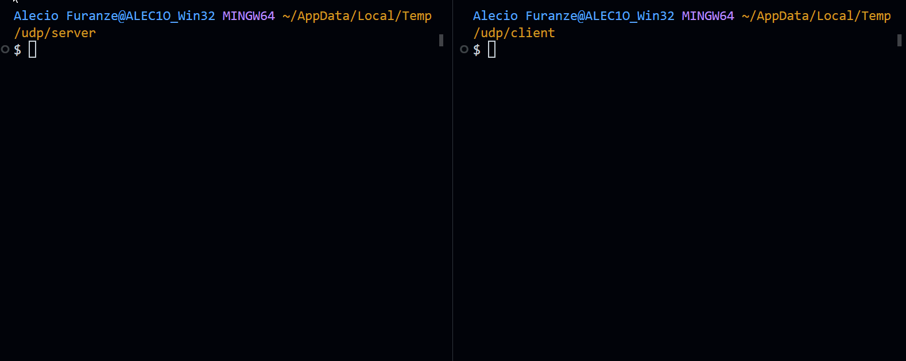

# Chat

Here is an example of a simple chat application using the Netly UDP library in a .NET console application.

### Example Code

```cs --title="ChatClient"
// Byter: allow serialize and deserialize primitive bytes and provide
// extension methods e.g. byte[].GetString() or string.GetBytes().
using Byter;
using Netly;

var client = new UDP.Client();


// callback called when client open connection successful
client.On.Open(() =>
{
    Console.WriteLine("Connected to server");

    client.To.Data("Hello World!"); // send raw data
    client.To.Event("welcome", "Hello Server!"); // send event
});

// callback called when client close connection
client.On.Close(() =>
{
    Console.WriteLine("Disconnected from server");
});

// callback called can't open connection, exception contain de cause.
client.On.Error((exception) =>
{
    Console.WriteLine("Error: " + exception.Message);
});

// callback called when client receive raw data.
// you can handle this data on your own.
client.On.Data((bytes) =>
{
    Console.WriteLine("Received raw message: " + bytes.GetString());
});

// callback called when client receive event.
// event is a string, and data is a byte array.
// event only work on netly server/client.
// is same that raw data but is internal implemented
// to make easy and fast data manipulation.
// event name contain name of event, event data contain bytes of event data.
client.On.Event((string name, byte[] bytes) =>
{
    if (name == "chat")
        Console.WriteLine($"CHAT: {bytes.GetString()}");
    else
        Console.WriteLine($"Unknown event: {name}");
});

await client.To.Open(new Host("127.0.0.1", 8080));

while (true)
{
    Console.WriteLine("Enter message: ");
    string message = Console.ReadLine();
    client.To.Event("CHAT", message);
}

await client.To.Close();
```

<br/>

:::info
Instance type of UDP.Client is same on server and client side, it is changed internal to work as client-side and server-side, it mean the unique differences is UDP.Client on server-side can't allow open connection from `UDP.Client.To.Open(<host>)` but other things is same.
:::

<br/>

```csharp --title="ChatServer"
using Netly;
using Byter;
using System;
using System.Collections.Generic;
using System.Threading;
using System.Threading.Tasks;

var server = new UDP.Server();

server.On.Open(() =>
{
    Console.WriteLine($"Server started at: {server.Host}");
});

server.On.Close(() =>
{
    Console.WriteLine($"Server stopped at: {server.Host}");
});

server.On.Error((exception) =>
{
    Console.WriteLine($"Error: {exception}");
});

server.On.Accept((client) =>
{
    // scope reserved to each client
    // each client have on scope like this.

    // it mean each client will have own instance of eventData and rawData
    List<(string message, byte[] data)> eventData = new();
    List<byte[]> rawData = new();


    // detect offline client
    var timer = DateTime.Now.AddSeconds(5);

    Task.Run(() =>
    {
        while(timer > DateTime.Now)
        {           
            Thread.Sleep(500);
        }

        // disconnect because is silent
        Console.WriteLine($"Server detected client {client.Host} is offline.");
        client.To.Close();
    });


    client.On.Open(() =>
    {
        Console.WriteLine($"Server: Client connect from: {client.Host}");
        // client connected
    });

    client.On.Close(() =>
    {
        // client closed;
        Console.WriteLine($"Client {client.Host} disconnected");

        // clean all data received by this client
        rawData.Clear();
        eventData.Clear();
    });

    client.On.Data((bytes) =>
    {
        Console.WriteLine($"Client data ({client.Host}): {bytes.GetString()}");
        server.To.DataBroadcast(bytes); // broadcast data

        // save history of data
        rawData.Add(bytes);
        
        // resent timeout
        timer = DateTime.Now.AddSeconds(5);
    });

    client.On.Event((name, bytes) =>
    {
        Console.WriteLine($"Client event ({name}): ({client.Host}): {bytes.GetString()}");
        server.To.EventBroadcast(name, bytes); // broadcast event

        // save history of events
        eventData.Add((name, bytes));

        // resent timeout
        timer = DateTime.Now.AddSeconds(10);
    });
});

server.To.Open(new Host("127.0.0.1", 8080));

Console.WriteLine("Server is running. Press any key to stop.");
Console.ReadKey();
server.To.Close();
```

### Example Demo (\*.GIF)


